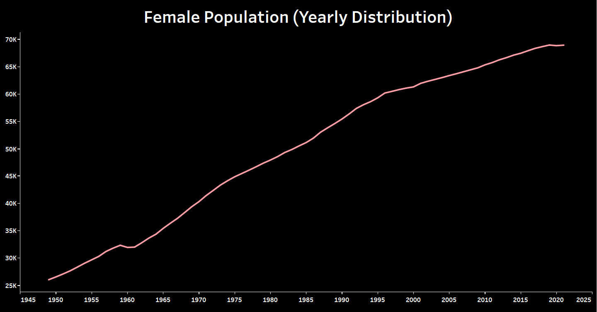
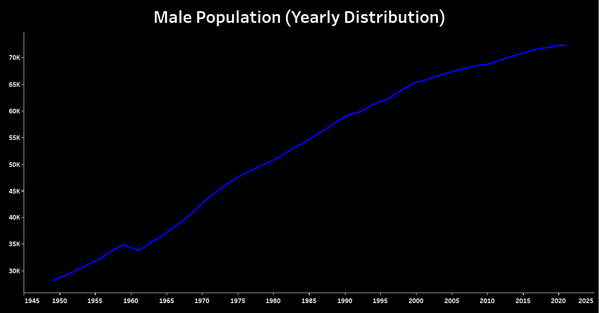
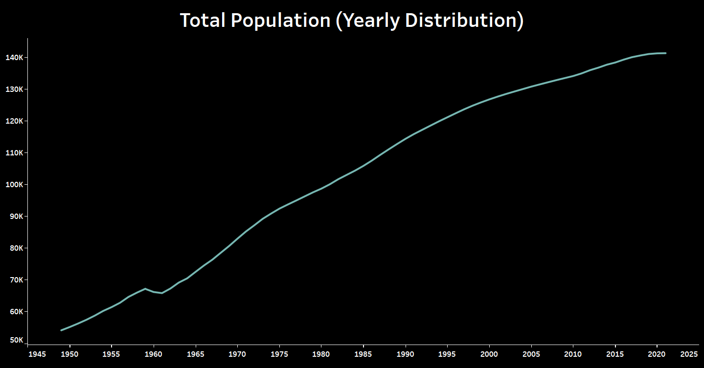
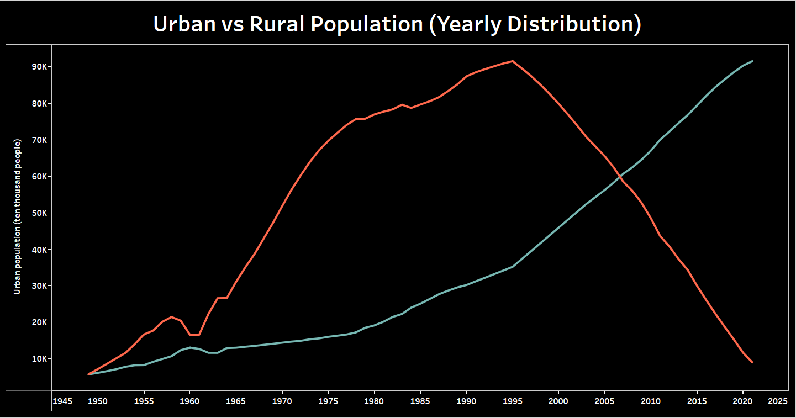
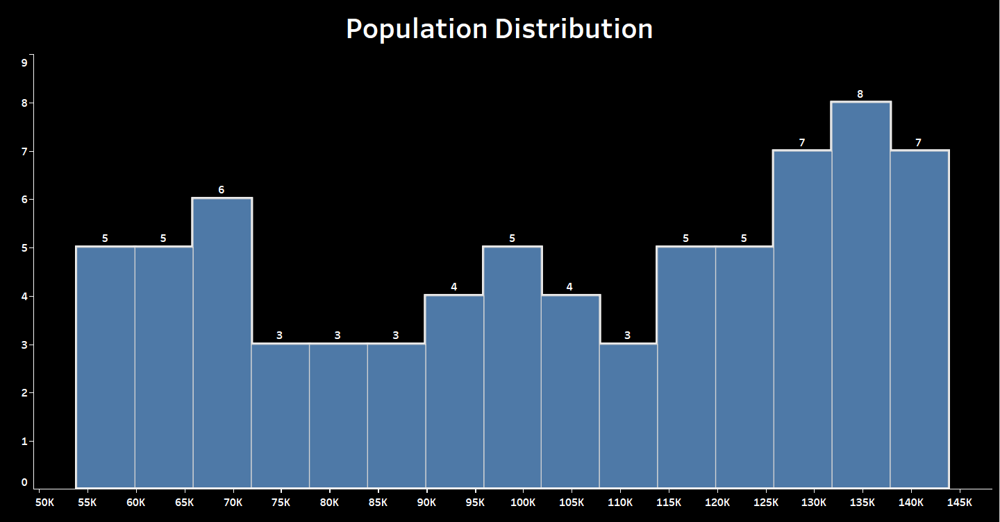

# PRODIGY-DS-01
Problem Statement :- Create a bar chart or histogram to visualize the distribution of a categorical or continuous variable, such as the distribution of ages or genders in a population.

## About the Data

Note: Population data in 1981 and before are household registration statistics; The data of 1982, 1990, 2000, 2010 and 2020 are calculated from the census data of the same year. Data for the remaining years were derived from annual population sampling surveys. Active servicemen are included in the total population and population by sex, and active servicemen are included in the urban population by urban and rural population.

    
Source: National Bureau of Statistics.

Data - https://www.kaggle.com/datasets/concyclics/chinas-population-by-gender-and-urbanrural?select=Chinas+Population+En.csv

### Preview

